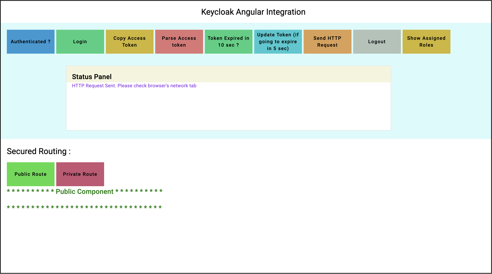
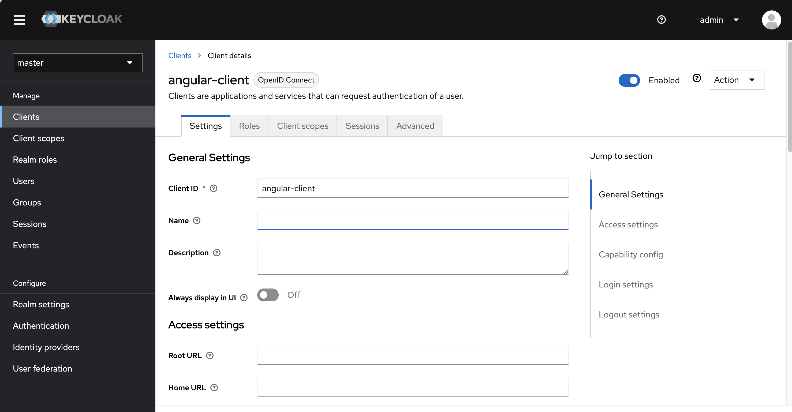
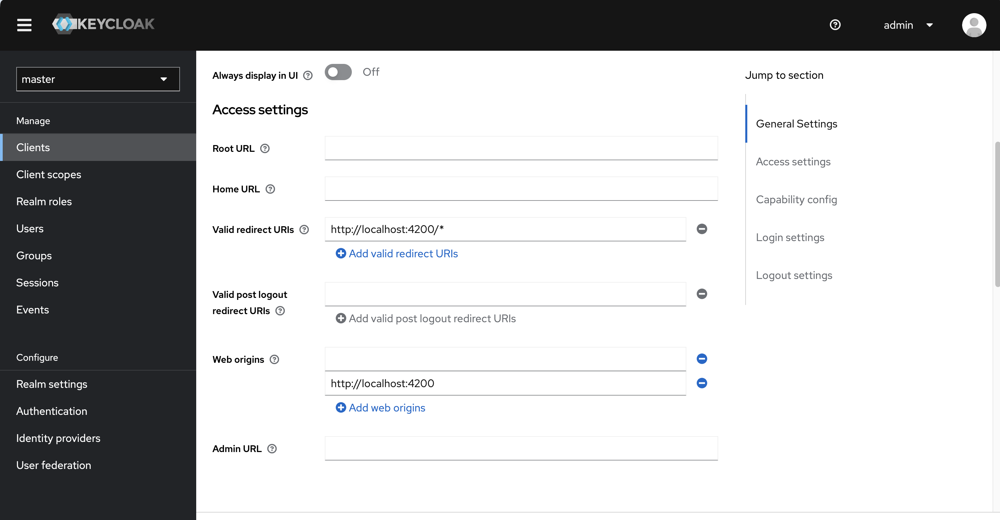

# Keycloak Angular Example

This project was generated with [Angular CLI](https://github.com/angular/angular-cli) version 17.3.6.

## Development server

Run `ng serve` for a dev server. Navigate to `http://localhost:4200/`. The application will automatically reload if you change any of the source files.

## Keycloak Integration

1. There should be a running keycloak instance (Keycloak version 22 is used for testing this implementation)
2. Create a client inside the Keycloak server as mentioned in Keycloak Client Info section
3. Provide the config details of the created client as config properties for the keycloak client initialization function (see app.config.ts file)
4. Start the angular app

## Keycloak Client Info

##### Disable unnecessary redirect URIs and web origins (if exist) when running on production mode.

* client id : angular-client
* valid redirect url: http://localhost:4200/*
* web origins:  http://localhost:4200
* Authentication flow: Standard Flow (Authorization code grant type)

###### By Default SHA256 based Proof key for code exchange (PKCE) method is enabled

## Functions (Buttons) of the App
##### Authenticated

Check whether the user is already logged into the system. Indicated as true or false

##### Login

Initiate the login process. (User will be redirected to the Keycloak loging page)

##### Copy Access Token

Copy the access token to the clipboard

##### Parse Access Token

Show the parsed access token in the status panel

##### Token expired in 10 seconds

Check whether the token is going to expire within 10 seconds. Using the keycloak angular sdk provided function

**this.keycloakService.isTokenExpired(n)** if the token is going to expire within n seconds, this will return true

##### Update token (if gonna expire)

This function is also working in a similar way to **isTokenExpired** method. This function will update the token if it is going to expire within the given number of seconds.

##### Send HTTP Request

Send a request to the given mockbin url. This HTTP request contains the received access token as a bearer token.

##### Logout

Logout the user from the system.

##### Show Assigned Roles

Show all the assigned roles to the user including both **realm roles** and **client roles**.

Similarly you can use the function **this.keycloakService.isUserInRole('role name')** to directly check whetehr a particular user has a specific role assigned.

**Important !!!**
When using single page apps (client-side applications), the client has to be a **public client** as there is no secure way to store client credentials in a client-side application. This consideration makes it very important to make sure the redirect URIs you have configured for the client are correct and as specific as possible.

You also need to configure Valid Redirect URIs and Web Origins. Be as specific as possible as failing to do so may result in a security vulnerability.

**References**

* Keycloak Javascript Adapter options are available here (API reference)
https://www.keycloak.org/docs/latest/securing_apps/index.html#api-reference

* Keycloak Angular SDK available here
https://www.npmjs.com/package/keycloak-angular
